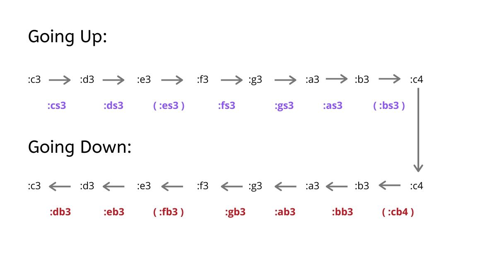

# Introduction

For this workshop, we'll work with a little bit of pre-written code. Through each step, we will, on one hand,
improve this code from a programming point of view (make it more elegant, less repetitive and more efficient)
and on the other, we will learn some music and live coding tricks that will help us improve the musicality of
our piece without too much effort.

To start, open `your-awesome-tune.rb` here on Github. Take a moment to read the code and try to get a general understanding of what it does. When you're ready, copy/paste its content into an empty Sonic Pi buffer
and press `Play`.

## Examining the code

Even though this tune is pretty simplistic, there are a few concepts to understand before moving on. Let's go over it to make sure everything is clear before moving on.

`use_bpm` : If you remember from week 1, we discussed the fact that Sonic Pi uses `sleep` commands to allow us to hear sounds one after the other instead of all together at the same time. As a default, Sonic Pi uses seconds to time it's instructions. So `sleep 1` means "wait 1 second". With `use_bpm`, we can change that default value. In this case,
the code sets it to 120, which means that `sleep 1` will now mean "wait for 0.5 seconds".

### Notes are numbers but they have names

In the first week, we spoke of notes as being represented by numbers inside Sonic Pi. That's great
because it allows us to play with sounds even if we don't have any background in music but there's arguably
an "easier" way to reference notes inside Sonic Pi.

**Just enough music theory to understand notes**

Here's the very basics of how music notation works:

- The names of notes all start by one of these letters: a, b, c, d, e, f, g
- There's **12 notes** in an __octave__
- An `octave` is the distance between one note and the same note higher or lower. So if you start on `a`
  and play all possible notes one after the other going up then the 13th note will again `a`, only one `octave`
  higher.

In Sonic Pi, note names are saved as variables that we can use. Each note name starts with a `:`, then a letter (`a, b, c, d, e, f or g`) and finally a number indicating how high or low the sound is (the number of octaves).

For example:

`play 60` is equivalent to `play :c4`.

Now comes the tricky part. 12 notes but only 7 letters... how do we notate the remaining frequencies?
It's possible to access more frequencies by going __in between__ the main notes. To do that, we add an `s` after
the letter if we want a note a bit higher or a `b` if we want a note a little bit lower.

Here's a diagram to make it a bit easier to visualize:

### Understanding basic sound parameters

- `amp` : how loud is the sound, default value is 1

- `cutoff` : helps to isolate a specific range of frequencies. A low cutoff will make a very bright sound seem more muffled. The best way to
familiarize yourself with what it does is to give it a try with different sounds and see how the sound gets affected when you change the `cutoff` value.

- `rate`: Affects the speed the sound is played. Normal speed has the value of 1, which is the default. If you use negative numbers, the sound will be played in reverse!

- `decay`, `sustain`, `release` : These 3 parameters affect the overall length of the sound. A long sustain, for example, should create a long note. The `release` value indicates how long it takes for the sound to die down and the `decay` is the time it will take for the note to reach it's full volume.

__See Sonic Pi's documentation for a complete explanation__

With that said, we can [move forward to Step 1](./Step-1.md) :tada:
